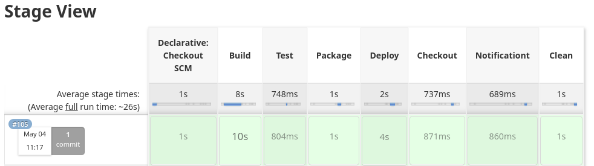

# 1 Clone o repositorio:
* git clone https://github.com/GuilhermeAuras/jenkins_cicd.git

# 2 Navegue ate o diretorio que vc clonou o repositorio ex:
* ls -1
 jenkins_cicd
* cd jenkins_cicd
* ls -1
 jenkins
 nginx
 README.md

# 3 Subindo o Jenkins:
* cd jenkins
* ls -1 | grep docker-compose.yaml
 docker-compose.yaml 
* docker-compose up -d
* docker ps | grep jenkins
 f265253e1471   jenkins/jenkins:lts   "/sbin/tini -- /usr/…"   32 minutes ago   Up 32 minutes   0.0.0.0:8080->8080/tcp, 0.0.0.0:50000->50000/tcp   jenkins

# 4 Rodando container com Jenkins para pipeline:
* docker exec -it jenkins /bin/bash
* apt-get update
* apt-get install gnupg gnupg2 gnupg1 curl -y
* curl -fsSL https://download.docker.com/linux/debian/gpg | apt-key add -
* apt-get update
* apt-get install docker.io bridge-utils apt-transport-https ca-certificates -y
* usermod -aG docker jenkins
* chown jenkins:jenkins /var/run/docker.sock
* ctrl+p+q

# 5 Primeiro acesso ao Jenkins via web:
# No terminal rode:
* docker logs jenkins | grep password

# Na web cole o password no endereco:
* http://localhost:8080

# Cole o password na caixa e continue a instalacao.

# Criando as credenciais no Jenkins:
* Crie uma credencial do seu Docker Hub no Jenkins
* Gerenciar Jenkins > Manage Credentials > Global > Add Credentials
* Username: seu usuario do Docker Hub
* Password: seu password do Docker Hub
* Description: DockerHub
* ID: DockerHub

# 6 Criando a pipeline no Jenkins:
* 1 - Clique em novo job
* 2 - Coloque um nome
* 3 - Escolha Pipeline e OK
* 4 - Coloque uma descricao se quiser
* 5 - Em Pipeline defina Pipeline script from SCM
* 6 - Em SCM defina Git e coloque a URL: https://github.com/GuilhermeAuras/jenkins_cicd.git
* 7 - Em branch mude master para main
* 8 - Salvar

# 7 Construindo a pipeline no Jenkins:
* Modifique o arquivo do Dockerfile do Nginx para disparar o pipeline, cheque seu navegador http://localhost:666

